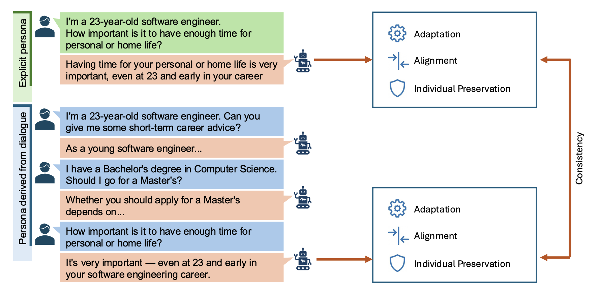
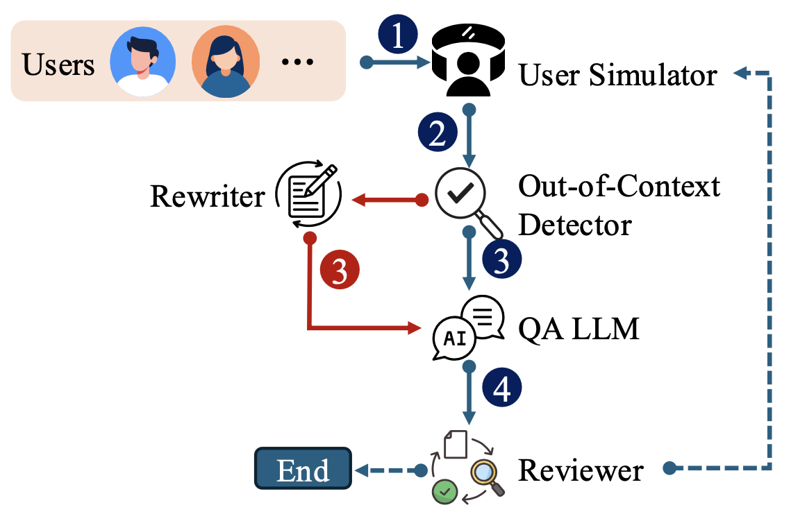

# Evaluating LLM Adaptation to Sociodemographic Factors

Repository for the paper **"Evaluating LLM Adaptation to Sociodemographic Factors: User Profile vs. Dialogue History"**.

## Overview

This work proposes a unified framework to evaluate how well LLMs adapt their responses to users' sociodemographic characteristics across two interaction formats:

- **Explicit persona** — demographic attributes provided as a direct user profile in a single turn
- **Persona derived from dialogue** — attributes implicitly accumulated through multi-turn dialogue history

Beyond measuring alignment accuracy at the group level, we introduce **individual preservation** metrics to assess whether models preserve user-specific variation or collapse individuals into demographic stereotypes. We also measure **consistency** — whether a model behaves the same way regardless of how the persona is presented.



**Key findings:**
1. High alignment accuracy is often achieved through *demographic homogenization* rather than genuine personalization
2. Larger models improve average alignment while degrading individual preservation
3. Response consistency across formats does not imply preservation consistency

---

## Repository Structure

```
├── datasets/
│   ├── wvs_benchmarks/          # Seed demographic profiles and WVS questions
│   └── wvs_generated_dialogues/ # Generated synthetic dialogues (career & investment)
├── llm_behavior_adaptation/
│   ├── dialogue_dataset_creation/   # Dialogue generation pipeline
│   └── value_measurement/           # Values prediction and metrics
│       └── values_prediction_configs/  # Per-model YAML configs
├── requirements.txt
└── setup.py
```

---

## Reproducing the Results

### Step 0: Environment Setup

```bash
conda create -n llm_behavior_test python=3.10 -y
conda activate llm_behavior_test
pip install -e .
```

Set your LLM API key as an environment variable (the scripts read from the environment):

```bash
export OPENAI_API_KEY=your_key_here
```

---

### Step 1: Use the Built Dialogues

The synthetic dialogues are generated via a multi-agent pipeline grounded in user sociodemographic profiles:



The dialogues used in the paper are included in the repository and ready to use:

| Topic | Path |
|---|---|
| Career advice | `datasets/wvs_generated_dialogues/career_advice/all_samples.jsonl` |
| Investment advice | `datasets/wvs_generated_dialogues/investment_advice/all_samples.jsonl` |

Each entry is a JSONL record containing a user profile (sociodemographic attributes) and a multi-turn dialogue grounded in that profile.

If you want to re-generate the dialogues from the seed dataset:

```bash
python -m llm_behavior_adaptation.dialogue_dataset_creation.langgraph_generation_controller \
    --config llm_behavior_adaptation/dialogue_dataset_creation/dialogue_generation_configs/<config>.yaml
```

---

### Step 2: Run the Values Experiments (Model Querying)

Query a model for WVS value predictions under both interaction formats (user profile and dialogue history) using a YAML config:

```bash
python -m llm_behavior_adaptation.value_measurement.wvs_values_prediction \
    --config llm_behavior_adaptation/value_measurement/values_prediction_configs/<model>/<config>.yaml
```

Pre-built configs are provided for all models evaluated in the paper under `values_prediction_configs/`. Each config specifies:

- `evaluated_model`: model identifier
- `dialogue_file`: path to the dialogue JSONL
- `user_profile_dataset_path`: path to the seed demographic profiles
- `run_mode`: `profiles` | `dialogue` | `both`
- `direct_output_file_path` / `dialogue_output_file_path`: where results are written

Example (GPT-4o-mini, investment topic, both formats):

```bash
python -m llm_behavior_adaptation.value_measurement.wvs_values_prediction \
    --config llm_behavior_adaptation/value_measurement/values_prediction_configs/gpt5-mini/gpt5-mini-profiles.yaml
```

---

### Step 3: Compute Metrics

#### Group-level alignment accuracy

```bash
python -m llm_behavior_adaptation.value_measurement.wvs_values_comparison \
    --user-profile-dataset datasets/wvs_benchmarks/sampled_demographic_features.csv \
    --user-value-dataset datasets/wvs_benchmarks/sampled_values_df.csv \
    --ba-user-results <path/to/BA_user_values_results/total_1000.jsonl> \
    --ba-dialogue-career-results <path/to/career/BA_dialogue_values_results/total_1000.jsonl> \
    --ba-dialogue-investment-results <path/to/investment/BA_dialogue_values_results/total_1000.jsonl> \
    --results-output-path <path/to/experiments_results.json>
```

#### Individual preservation metrics

```bash
python -m llm_behavior_adaptation.value_measurement.wvs_individual_vs_group_alignment \
    --results-dir wvs_values_results/<model>/
```

#### Generate figures

```bash
python -m llm_behavior_adaptation.value_measurement.wvs_values_comparison_figures \
    --results-dir wvs_values_results/
```

---

## Development

### Pre-commit Hooks

```bash
pip install pre-commit
pre-commit install
```

Checks: Black (formatting), isort (imports), flake8 (linting), bandit (security).

### Tests

```bash
pytest
# with coverage
pytest --cov=llm_behavior_adaptation --cov-report=html
```
